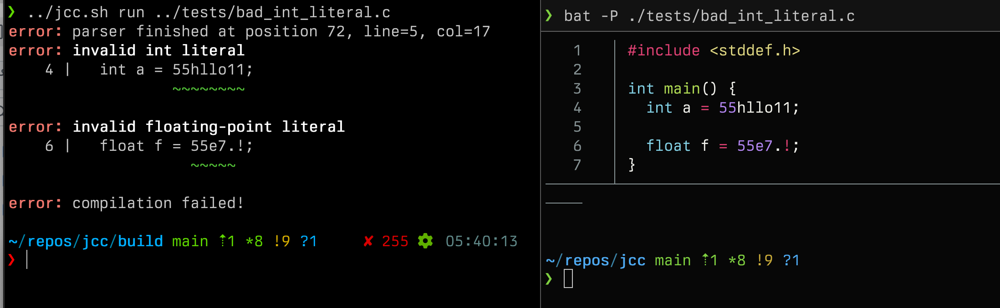

# Parse

The parsing stage involves 4 principal stages:

* Preprocessing
  - Runs the C preprocessor, handling `#` directives
* Lexing
  - Tokenises the output of the preprocessor
* Parsing
  - Builds a highly generic AST which can parse a much larger set of programs than are legal in C
  - This allows emitting significantly clearer diagnostics than if it parsed more strictly
* Typing
  - Types the tree and performs most validation to reject invalid programs
Being able to perform all of these steps very quickly is essential, and so these components have been carefully optimised. The current parser-lexer-preprocessor combination can achieve approximately 600k lines-of-code per second per thread, a very similar rate to clang and marginally faster than gcc. These benchmarks were performed on generated code from `csmith`, JCC itself, and the sqlite3 amalgamation file.

Preprocessing will mostly be ignored here, but it is important to understand how it interacts with the lexer and the parser. The preprocessor produces `struct preproc_token`s in a forward-only manner - it cannot backtrack. Each preprocessor token is 1-1 with a lexer token, no splitting nor merging occurs by the lexer.

The driver invokes the parser, which creates lexer and preprocessor instances. As parsing occurs, it interacts with the lexer via a few methods:

```c
struct lex_pos lex_get_position(struct lexer *lexer);
struct text_pos lex_get_last_text_pos(const struct lexer *lexer);

void lex_peek_token(struct lexer *lexer, struct lex_token *token);
void lex_consume_token(struct lexer *lexer, struct lex_token token);

void lex_backtrack(struct lexer *lexer, struct lex_pos position);
```

#### `lex_get_position` and `lex_get_last_text_pos`

These are used to query the current position of the lexer. `lex_get_position` returns an opaque type `struct lex_pos` which represents the internal lexer position and can be used for backtracking via `lex_backtrack`, whereas `lex_get_last_text_pos` is used to retrieve a `struct text_pos` which is used for both diagnostic generation and giving each AST node a text span indicating its position in the source.

#### `lex_peek_token` and `lex_consume_token`

`lex_peek_token` will return the next token in the stream of lex tokens, so the parser can determine if it wants to consume it. If it does, it will then call `lex_consume_token` with that token to move the lexer forward to the next token.

#### `lex_backtrack`

This moves the lexer's internal position back to the position represented by `struct lex_pos`. The lexer does not re-lex tokens (as this would be wasteful), and instead maintains an internal buffer of pre-lexed tokens which it reads from when possible, only lexing a new token if none are left in the buffer.

### Lexing process

When there are no tokens left in its buffer, the lexer will lex a new token. The first step is to retrieve the next token from the preprocessor:

```c
struct preproc_token preproc_token;
do {
  preproc_next_token(lexer->preproc, &preproc_token,
                     PREPROC_EXPAND_TOKEN_FLAG_NONE);
} while (preproc_token.ty != PREPROC_TOKEN_TY_EOF &&
         !text_span_len(&preproc_token.span));
```

> Note: The preprocessor token flags are irrelevant as they are only used by the preprocessor during macro expansion

The preprocessor may generate empty tokens (such as from macro-references of empty definitions) and the lexer skips these. Other token types are skipped later, but it is important to do this here because the preprocessor may generate empty tokens of any type (this allows it to perform certain operations more efficiently), and so a token of type `PREPROC_TOKEN_TY_IDENTIFIER` that is empty cannot be handed to the parser.

Because the preprocessor must be aware of various different token types (punctuators, preproc-numbers, identifiers, etc) the work of the lexer is relatively limited.

The identifier type of token maps to a lex token of either identifier or keyword. The `refine_ty` method performs a hashtable lookup against a pre-built keyword table, returning the relevant keyword type or identifier if it is not a keyword. Similarly, because the preprocessor relies on punctuation for much of its syntax, these tokens can simply be mapped from the preprocessor type to the lexer type via `preproc_punctuator_to_lex_token_ty`, which is simply a large switch table (that is optimised into a LUT by clang).

```c
case PREPROC_TOKEN_TY_IDENTIFIER: {
  enum lex_token_ty ty = refine_ty(&preproc_token);
  *token = (struct lex_token){
      .ty = ty, .text = preproc_token.text, .span = preproc_token.span};
  return;
case PREPROC_TOKEN_TY_PUNCTUATOR:
  *token = (struct lex_token){
      .ty = preproc_punctuator_to_lex_token_ty(preproc_token.punctuator.ty),
      .text = preproc_token.text,
      .span = preproc_token.span};
  return;
}

```

The preprocessor number token type covers all integer and float literals, as well as various illegal number-like literals. `lex_number_literal` does not truely parse the number, but uses the suffixes (such as `55UL` or `33.7f`) to determine the type of the literal as this is encoded within the token. It intentionally allows illegal literals so the parser can reject them with a diagnostic.

```c
case PREPROC_TOKEN_TY_PREPROC_NUMBER:
  *token = (struct lex_token){.ty = lex_number_literal(&preproc_token),
                              .text = preproc_token.text,
                              .span = preproc_token.span};
  return;
```



The final category is string literals, which also includes character literals - the naming is for symmetry with standard preprocessor parlance.
It simply determines the type of string or character (wide or regular) and returns the token.

```c
case PREPROC_TOKEN_TY_STRING_LITERAL:
  *token = (struct lex_token){.ty = lex_string_literal(&preproc_token),
                              .text = preproc_token.text,
                              .span = preproc_token.span};
  return;
```

EOF & Unknown type tokens are passed to the parser so it can end (on EOF) or emit a diagnostic (on unknown token);

```c
case PREPROC_TOKEN_TY_UNKNOWN:
  *token = (struct lex_token){.ty = LEX_TOKEN_TY_UNKNOWN,
                              .text = preproc_token.text,
                              .span = preproc_token.span};
  return;
case PREPROC_TOKEN_TY_EOF:
  *token = (struct lex_token){.ty = LEX_TOKEN_TY_EOF,
                              .text = preproc_token.text,
                              .span = preproc_token.span};
  return;
```

Other token types are skipped or not relevant
```c
case PREPROC_TOKEN_TY_COMMENT:
case PREPROC_TOKEN_TY_NEWLINE:
case PREPROC_TOKEN_TY_WHITESPACE:
  continue;
case PREPROC_TOKEN_TY_DIRECTIVE:
  BUG("directive token reached lexer");
case PREPROC_TOKEN_TY_OTHER:
  TODO("handler OTHER preproc tokens in lexer");
}
```

### Parsing

The parser is a hand-written recursive-descent parser. It builds a very flexible AST with significantly weaker rules than C in order to faciliate good diagnostic generation as well as making error-recovery significantly easier.

#### `struct var_table`

The var-table type is used by typechecking to manage types and variables across different scopes. It supports pushing and popping scopes, and namespacing of different types (such that `struct foo` and `union foo` do not conflict). We re-use this type within the parser to deal with the typedef ambiguity problem. The parser maintains a single var table, called `ty_table`. When it parses a declaration, it notes whether `typedef` was present, and if so it adds the names from the declaration into this table. It does not record the types involved, as that information is not yet available and is unnecessary here.

Then, the `parse_typedef_name` function uses this table to determine if the name in question is a typedef name:

```c
static bool parse_typedef_name(struct parser *parser,
                               struct lex_token *typedef_name) {
  struct lex_token identifier;
  lex_peek_token(parser->lexer, &identifier);

  if (identifier.ty != LEX_TOKEN_TY_IDENTIFIER) {
    return false;
  }

  // retrieves the string from the identifier
  struct sized_str name = identifier_str(parser, &identifier);

  // VAR_TABLE_NS_TYPEDEF is the namespace
  // As we only use it for typedefs, it is not needed in parser (only typechk) but we keep it for consistency
  struct var_table_entry *entry =
      vt_get_entry(&parser->ty_table, VAR_TABLE_NS_TYPEDEF, name);
  if (!entry) {
    return false;
  }

  *typedef_name = identifier;

  lex_consume_token(parser->lexer, identifier);
  typedef_name->span = identifier.span;
  return true;
}
```
